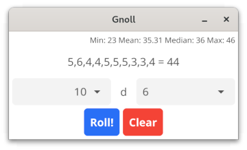

# gnoll

Originally a GTK4 dice roller, but rewritten in [Fyne](https://fyne.io/) because OMG packaging.



## Features

* Mobile/desktop/WASM packaging
* Number picker (1-100) for number of die & number of faces
* Statistics of historical rolls (current session)
* *Clear* session button

## Install

You can absolutely grab a release, find the ``gnoll`` executable, and be do whatever you like with it. If you want to do proper installs and/or builds, however:

1. Install Go
1. Install Gcc

### Linux, from release package using fyne

```
go install fyne.io/fyne/v2/cmd/fyne@latest
fyne install Gnoll.tar.xz
```

### native builds using fyne

```
git clone https://github.com/cognusion/gnoll.git
go install fyne.io/fyne/v2/cmd/fyne@latest

fyne package -os linux    #if awesome
fyne package -os windows  #if Windows
fyne package -os darwin   #if Mac
fyne package -os android  #if adventurous

fyne install
```

### flatpak

1. Install flatpak-builder

```
git clone https://github.com/cognusion/gnoll.git
flatpak-builder --user --install --force-clean build-dir io.cognusion.gnoll.yml
```

#### upgrades

```
git pull
flatpak-builder --user --install --force-clean build-dir io.cognusion.gnoll.yml
```